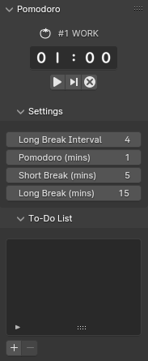
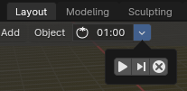
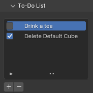

# What is Pomodoro?
The Pomodoro Technique is a time management method developed by Francesco Cirillo in the late 1980s. It uses a kitchen timer to break work into intervals, typically 25 minutes in length, separated by short breaks.

## How to Install

The easiest way to install the Pomodoro addon is directly within Blender. Follow these steps:

1. Open Blender and go to **Edit > Preferences > Add-ons > Install..**.
2. This will open a File Browser in Blender.
3. Navigate to and select the zip file you downloaded.
4. Click **Install Add-on**.

## How to Use

You can find the main panel in the sidebar: **3D View > Tool > Pomodoro**.

### Timer

The timer component consists of three parts: the title, remaining time, and buttons. There are three types of Pomodoro blocks:

- **Work Block**
- **Break Block**
- **Long Break Block**

These blocks are indicated in the title. A "work" block is followed by a "break" block, and a "long break" block follows after four work blocks (by default). You can change the length and interval of these blocks in the "Settings" panel.

You can start, pause, skip, and reset the timer using the three buttons provided. A confirmation dialog will appear if you try to skip or reset the current block. Additionally, you can find smaller controls in the header for easy access:

The tomato icon will blink when the timer runs out, so you can easily keep track of time and pause/start as needed.

### To-Do List

This addon also includes a to-do list panel. You can add tasks by clicking the plus icon and delete tasks by clicking the minus icon. The to-do list is simple and straightforward, allowing you to manage your tasks efficiently.
