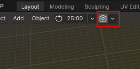
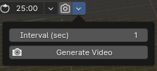
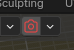

# Yf's Easy Timelapse in Blender

This addon allows you to take screenshots at regular intervals and save them in a folder within the Blender file's directory. Additionally, it provides a one-click functionality to generate a timelapse video from the screenshots. 
Adds a new panel to Blender's header for easy access and configuration.

Clicking the down arrow will reveal a small popover panel where you can adjust the screenshot interval. 
> **Note**: There might be a slight lag when taking a screenshot. Even though it is hardly noticeable, still, you may want to set a longer interval.

To start recording, click the camera icon. The addon will begin capturing screenshots at the set interval. All screenshots will be saved in the following directory: `./yf/timelapsy/[your blender file name]`.

## How to Install

The easiest way to install the addon is directly within Blender. Follow these steps:

1. Open Blender and go to **Edit > Preferences > Add-ons > Install..**.
2. This will open a File Browser in Blender.
3. Navigate to and select the zip file you downloaded.
4. Click **Install Add-on**.